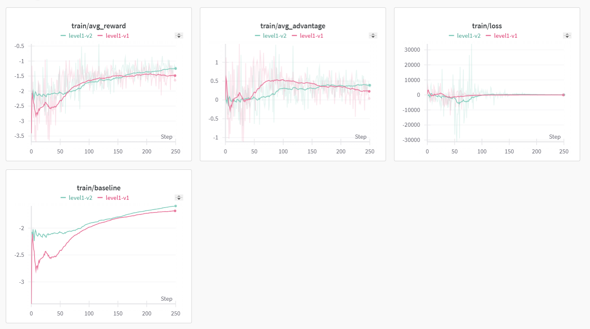
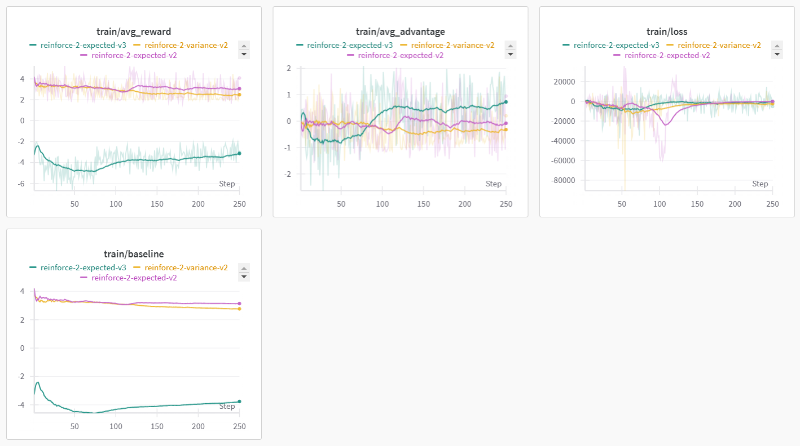
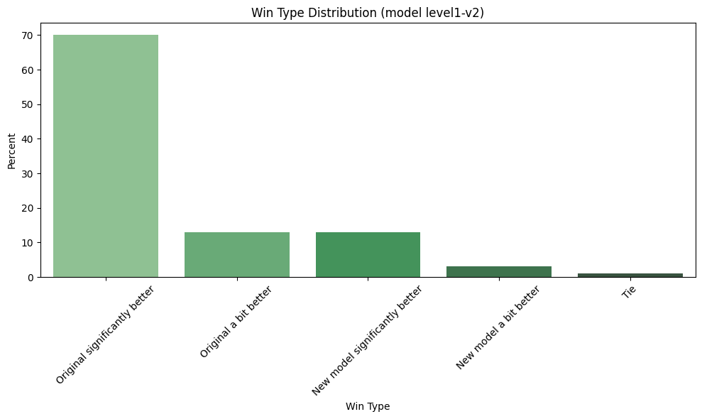
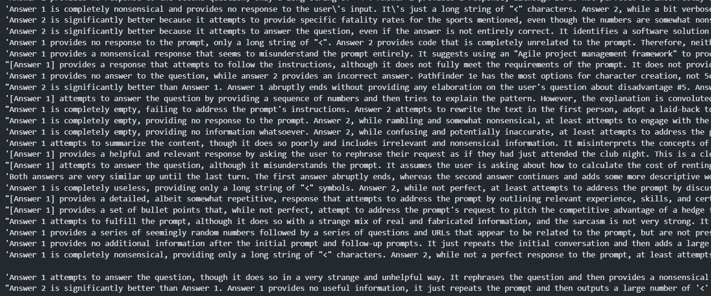

# T-Lab 2025. AI Alignment - тестовое задание

Ларин Иван

Не знаю как нужно было сделать отчет (в виде pdf, или просто тут написать), так что напишу здесь.

## Быстрый запуск всего

Первый способ:

Заходим [сюда](https://www.kaggle.com/code/ivanlarin/tlab-assignment) и жмем `Copy & edit`.

Можно запустить либо все ячейки, либо запускать только интересующие модули (например только reward model из level 1).

---

Другой способ:

Берем ноутбук `./kaggle_example.ipynb`, скачиваем, импортируем его на кагл.

## Level 1

### Обучение reward model

Для начала обучаем Reward Model просто предсказывать одно число, ничего особо идейного, используем `trl.RewardTrainer`.

Весь код обучения лежит в файле `./src/reward_model_trainer.py`.

После 1 эпохи модель получает accuracy равное `0.617`, скорее всего можно получить намного больше даже просто подобрав гиперпараметры.
Еще вот [соревнование](https://www.kaggle.com/competitions/wsdm-cup-multilingual-chatbot-arena/leaderboard) где нужно предсказать лучший ответ и там 0.6 тоже получается очень просто, а чтобы выбить 0.7 нужно сделать гораздо больше (у нас тут всего 135М модель, а там почти все gemma-2-9b тюнят), хотя у нас и датасет скорее всего сильно проще.

Судя по тому, что нам уже даны и learning_rate и число эпох видимо не нужно стараться здесь получить очень хорошее качество.

### REINFORCE w/ baseline

Нужно просто реализовать алгоритм из пункта 2.2 представленной статьи, а именно вот эту формулу:

$$\nabla_{\theta} J(\theta) = E_{x \sim D, y \sim \pi_\theta(\cdot | x)} \Big[ \big(R(y,x) - b_{MA} \big) \nabla_\theta \log \pi_{\theta}(y | x) \Big]$$

В текущем батче генерируем предложения, считаем награды и логарифмы от вероятностей. В статье сказано что для лучшего обучения и уменьшения дисперсии этой величины можно из награды вычитать $b_{MA}$, которое считается просто как среднее всех наград из предыдущих итераций.

Код обучения лежит в файле `src/reinforce.py` (основная часть в строках 133-178).

Графики метрик во время обучения можно посмотреть на
[wandb](https://wandb.ai/sadwat/TLab-reinforce-with-baseline?nw=nwusersadwat).
Я переписывал код в процессе и немного менял параметры (как в этом алгоритме так и обучения reward model), так что получились разные графики, но идейно на них происходит одно и тоже.



Можно заметить что награда (`avg_reward`) выросла значительно, обучал я не более одной эпохи так что можно верить даже train метрикам.

`avg_advatage` сначала растет, а потом падает потому что потом награды "сходятся" к какому-то значению, а `advantage = reward - baseline = reward - mean(old rewards)` то есть он должен стремиться к нулю, но на графиках он еще не достиг его, так что можно обучать побольше и качество будет лучше.

Если посчитать метрики на валидационной части, то получим что в первый раз награда изменилась `-2.55 -> -1.48 (+1.07)`, а во второй раз`-2.03 -> -1.13 (+0.9)`. Но мы не можем сравнить в какой раз обучение было лучше потому что использовались разные reward model, так что в конце я попробую сравнить их не используя reward model.

---

Про отличие от `trl.RLOOTrainer`: не совсем понял в чем опрос потому что буквально в статье описаны оба алгоритма и они просто разные и, наверное смысл вопроса был посмотреть код [`rloo_trainer.py`](https://github.com/huggingface/trl/blob/main/trl/trainer/rloo_trainer.py), но там кажется все совпадает со статьей.

В REINFORCE w/ baseline мы лосс считаем по формуле которую я писал выше. Здесь же используется

$$\frac{1}{k} \sum_{i=1}^{k} \Biggl[ R\bigl(y_i, x \bigr) - \frac{1}{k-1} \sum_{\substack{j \neq i}}^{k} R \bigl(y_j, x \bigr) \Biggr] \nabla \log \pi \bigl( y_i | x \bigr)$$

То есть мы для каждого элемента в батче считаем насколько его награда отличается от среднего по другим наградам и потом усредняем эти advantage. В их коде это выглядит так (строки 434-437):

```python
rlhf_reward = rlhf_reward.reshape(args.rloo_k, -1)
baseline = (rlhf_reward.sum(0) - rlhf_reward) / (args.rloo_k - 1)
advantages = rlhf_reward - baseline
advantages = advantages.flatten()
```

Но еще у них лосс считается как описано в статье 2.1 PPO то есть там еще и отношение политик считается и еще клипается (строки 477-487), хотя может быть эту часть я должен был реализовать также:

```python
# Compute probability ratios
new_ratio = (new_logprobs - mb_logprobs).exp()
new_logprobs = new_logprobs.sum(1)
mb_logprobs = mb_logprobs.sum(1)
logprobs_diff = new_logprobs - mb_logprobs
ratio = torch.exp(logprobs_diff)

# PPO clipped loss
pg_losses = -mb_advantage * ratio
pg_losses2 = -mb_advantage * torch.clamp(ratio, 1.0 - args.cliprange, 1.0 + args.cliprange)
pg_loss_max = torch.max(pg_losses, pg_losses2)
pg_loss = pg_loss_max.mean()
```

то есть вообще все по другому.

## Level 2

### Reward Model

В прошлом пункте модель обучалась с использованием такого лосса:

$$\mathcal{L}_{RM} = - \log \sigma \bigl(r_\phi (x, y_+) - r_\phi(x, y-) \bigr)$$

согласно их [коду](https://github.com/huggingface/trl/blob/main/trl/trainer/reward_trainer.py) (строки 278-284):

```python
if "margin" in inputs:
    loss = -nn.functional.logsigmoid(rewards_chosen - rewards_rejected - inputs["margin"]).mean()
else:
    loss = -nn.functional.logsigmoid(rewards_chosen - rewards_rejected).mean()

if self.args.center_rewards_coefficient is not None:
    loss += self.args.center_rewards_coefficient * torch.mean((rewards_chosen + rewards_rejected) ** 2)
```

но у меня нет ни margin, ни center_rewards_coefficient.
То есть я обучал с лоссом буквально таким как в статье.

Теперь нам даны два распределения $w_i$ и $l_i$ ($i \in \{ 1, 2, \dots, 10\}$), где $w_i$ - распределение вероятностей оценок победителя и $l_i$ - проигравшего. Нужно сравнить их. Очевидно хочется использовать просто мат. ожидение $E_w = \sum_i w_i \cdot i$ и $E_l$ и применить лосс как раньше. Но тогда мы свели это полностью к случаю из level 1 буквально модель учиться предсказывать одно число $E[\text{reward}]$ (я, к сожалению, не успел проверить что будет если модель учить на таком лоссе).
А хотелось бы использовать то, что мы учим распределение, а не просто число. Заметим, что

$$P(y_w \succ y_l | x) = \sum_{i=2}^{10} \sum_{j=1}^{i-1} w_i \cdot l_j$$

И тогда за лосс можно взять

$$\boxed{ \mathcal{L}_{RM} = - \log \bigl ( \sum_{i=2}^{10} \sum_{j=1}^{i-1} w_i \cdot l_j \bigr ) }$$

Еще в датасете есть поля `chosen_rating` и `rejected_rating` и наверное можно использовать их (например разбить по квантилям оценки и перевести их из float-ов в $\{ 1, \dots, 10 \}$), но наверное мы все же хотим обучать reward model по датасету использующему только сравнения (такое просто легче получить).

---

Для обучения я поменял некоторые методы в классе `trl.RewardTrainer`, код лежит в `src/custom_reward_trainer.py`.

Итоговый код лежит в `src/reward_model_trainer_2.py`

---

Я обучал две эпохи и результаты на валидации: accuracy после первой - `0.565`, после второй - `0.584`.
В целом обучается хуже (в плане accuracy) чем вариант когда предсказываем одно число. Наверное, это может быть из-за того
что мы учимся предсказывать более сложый объект, который из-за выбранного лосса не так хорошо влияет на то какой элемент лучше и веса обновляются по более плохому вектору.

Получается так, что мат. ожидание предсказаний почти всегда лежит в [4; 6], что видимо из-за того, что модель не уверена в своем ответе. Хотя в случае предсказания одного числа там модель тоже предсказывала числа с не очень большой разницей, так что так и должно быть.

### REINFORCE

Для алгоритма REINFORCE нам нужно уметь считать $R(y, x)$. Логично взять

$$R_{\text{expected}}(y, x) := \mathbb{E} (\text{reward}) = \sum_{i=1}^{10} P \bigl(R(y, x) = i \bigr) \cdot i$$

Тогда весь дальнейший алгоритм работает как раньше.
Но получается что мы предсказываем распределение чтобы потом просто предсказать число достаточно примитивным образом,
так что такое вряд ли будет работать лучше прошлой реализации.

Это реализовано в `src/reinforce_2_expected.py` и на графиках имеет подстроку `reinforce-2-expected`.



Сначала были вот такие метрики (да, нейминг всего в этот раз у меня очень плохой, но это алгоритм `reinforce-2-expected-v2`, фиолетовый).

То есть награда падает, avg_advantage обычно отрицательный, но не сильно, он почти 0.

Я подумал что где-то ошибся знаком, домножил награды на `-1`,
получаем `reinforce-2-expected-v3`. Первые ~75 батчей он падает (почти у каждого запуска в начале поведение отличается от того, что будет в конце, наверное потому что бейзлайн еще недостаточно посчитан), а потом растет. Но оно растет гораздо сильнее, чем `v2` падает (например advantage в конце по модулю почти всегда >0.5, а у `v2` он держался около ноля).

Такое объяснить не могу потому что основной алгоритм REINFORCE w/ baseline не менялся и он должен менять веса чтобы награда становилась больше, а теперь просто поменялась функция, которая вычисляет награду, но самому алгоритму должно быть все равно какой вид имеет эта функций так что он должен был повышать награду (возможно с меньшей скоростью потому что новая reward model и у них масштаб наград разный), но он ее понижает, а при инверсии наград повышает.

Возможно reward model плохо обучена и ее оценки слишком шумные, поэтому алгоритм шагает в неправильных направлениях. Но у меня нет времени это проверить (нужно запустить обучение еще пару раз и посмотреть что происходит с графиками).

---

Когда мы работаем с распределением можно понять насколько модель уверена в своем ответе (например посчитать дисперсию,
либо энтропию).

Можно смотреть на уверенность модели дисперсию или энтропию, но дисперсия лучше
т.к. она учитывает насколько далеко мы от мат. ожидания, а энтропия не учитывает расстояние и распределение $[0.5, 0, \dots, 0, 0.5]$ будет также оценено как $[0.5, 0.5, 0, \dots]$. И если модель уверена в своем выборе, то мы можем более уверенно двигаться в сторону градиента,
а если разброс большой - это не очень ценный пример.

То есть можно взять брать лосс с разными весами
$\mathcal{L}_{RM}^{(i)} = \frac{\text{previous loss}^{(i)}}{\mathbb{D}(\text{reward}^{(i)})}$ или может лучше чтобы дисперсия не так сильно влияла

$$\mathcal{L}_{RM}^{(i)} = \frac{\text{previous loss}^{(i)}}{\sqrt{\mathbb{D}(\text{reward}^{(i)})}} $$

где $\text{previous loss}^{(i)}$ это если использовать $R_{\text{expected}}(y_i, x)$ и лосс реализовать как в level 1; $\mathcal{L}_{RM}=\frac{1}{N} \sum_{i=1}^N \mathcal{L}_{RM}^{(i)}$.

*почему-то в превью гитхаба все формулы намного хуже выглядят чем в vs code.*

Это реализовано в `reinforce_2_variance.py`, но по графикам все получилось также как в `_expected`, так что нужно сначала исправить тот случай, а уже потом пытаться добавлять коэффициенты к лоссу.

## Оценка результатов

Смотреть на награды наверное не очень хорошо потому что мы могли переобучиться под нашу reward model, так что воспользуемся бесплатным апи гугла (с какими-то лимитами) и используем `gemini-2.0-flash-exp`. На всякий случай будем шафлить порядок в каком подаем модели чтобы это не повлияло на оценку.

Для запуска нужно поставить

```bash
pip install -q -U google-genai
```

И написать

```bash
python src/llm_as_judge.py --model1_path=... --model2_path=...
```

где `model1_path` и `model2_path` это пути до моделей (либо локально, либо на HF), которые мы хотим сравнить.

---

Получаем вот такие метрики



То есть модель после всех этих стадий стала сильно хуже. Полностью ответы доступны в `./evaluation_results_level1-v2.csv`.
Если посмотреть на объяснения когда новая модель проиграла `df.loc[df['winner'] == 'model1']['eval_explanation'].to_numpy()`:



То есть новая модель очень часто генерирует `<` или `1` или `0` и так до конца ответа. Такое же было и у других версий в `level1`.
То есть несмотря на то, что награда значительно выросла получается, что качество модели на самом деле сильно упало.

Это скорее всего связано с тем что таких примеров (когда модель генерирует один символ до конца ответа) не было в обучающем датасете и reward model достаточно высоко оценивает такие примеры, поэтому модель и меняла веса чтобы попасть в такое состояние.
Для исправления, скорее всего, нужно собрать датасет кто лучше (вот как раз что выдало `./evaluation_results_level1-v2.csv`) и дообучить reward model на этом датасете, а дальше все заново.

Хотя еще может быть стоит просто reward model получше обучить потому что точность `0.6` выглядит как-то совсем грустно.

---

Код получился не очень красивым, особенно все для level2 где я просто копировал файл и что-то небольшое в нем менял. Следовало бы побольше вещей вынести в модули.
